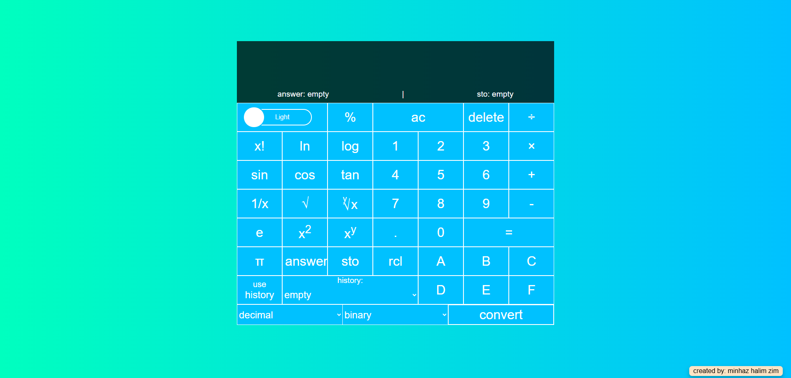
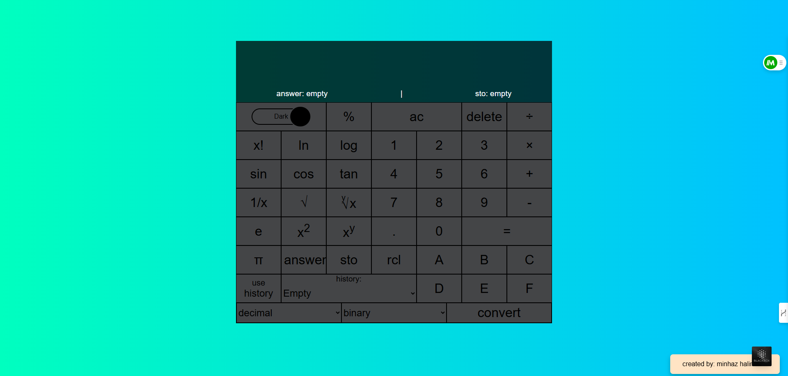
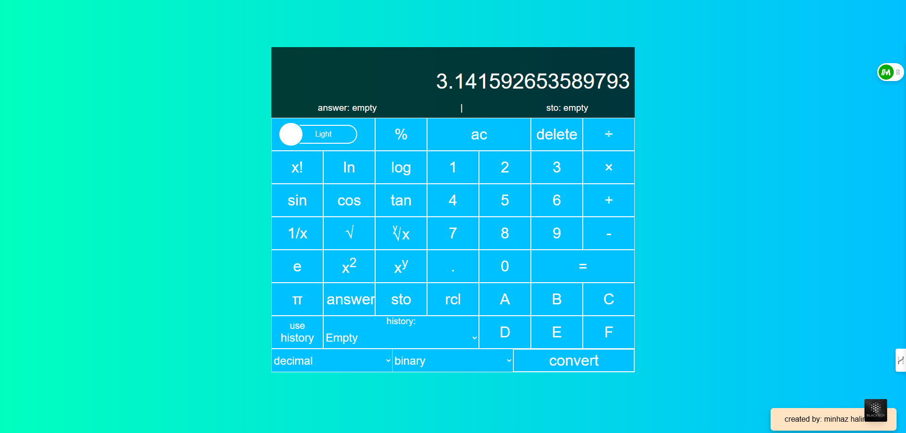
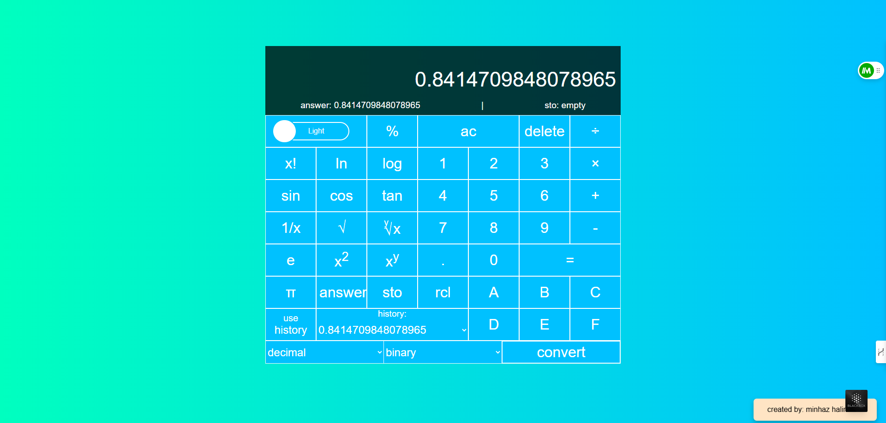
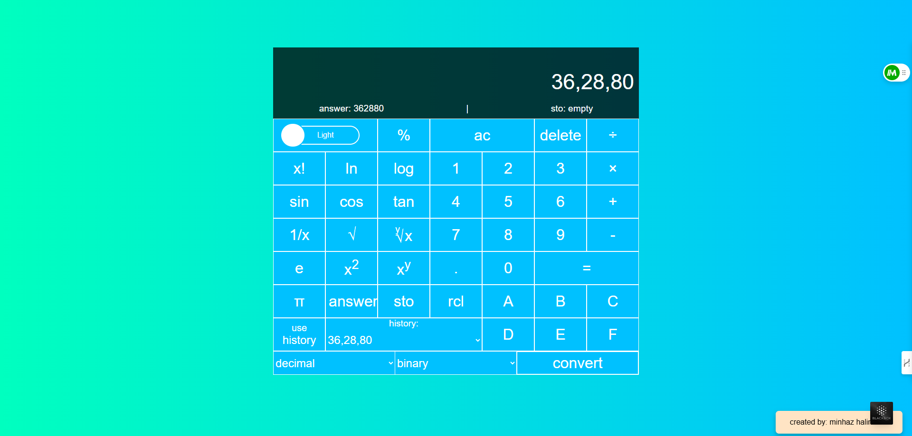
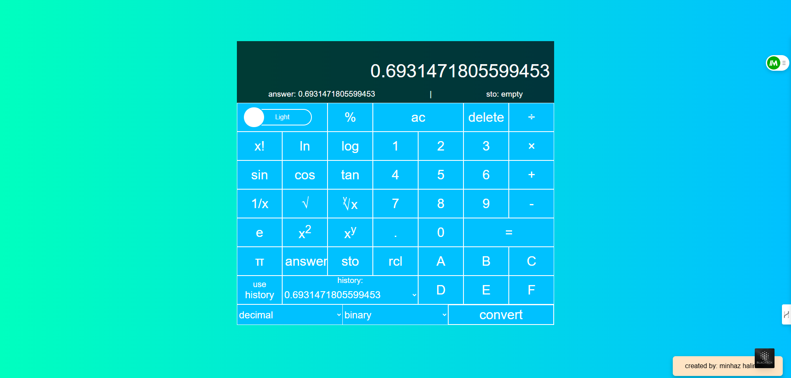
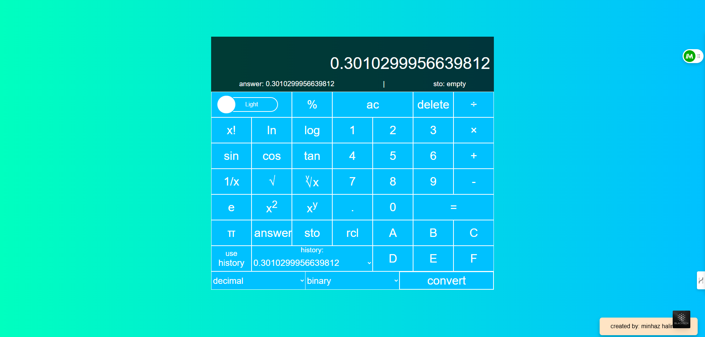
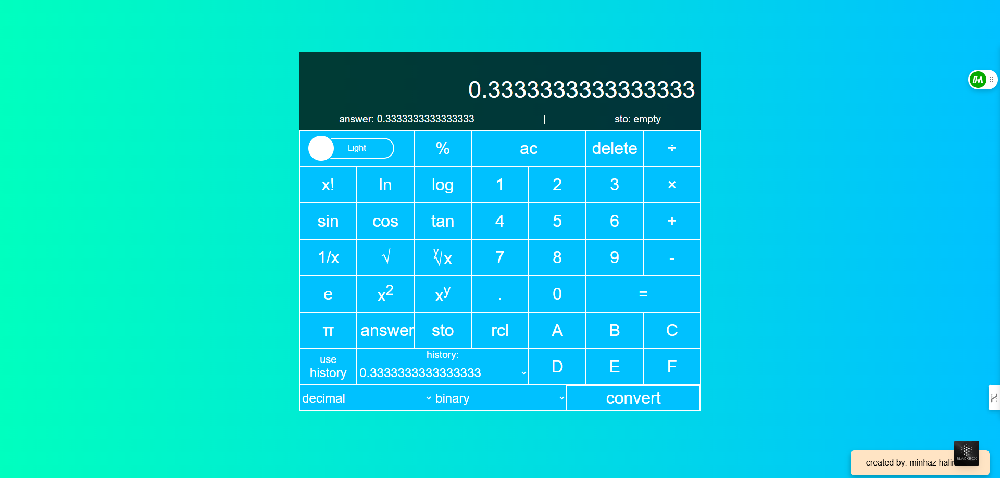

## Scientific Calculator Application

An elegant and fully-featured scientific calculator application built with core web technologies — no external dependencies or frameworks required.

## Overview

This is a web-based powerful, elegant, and rich-featured scientific calculator app is designed to provides a comprehensive set of mathematical functionalities through basic calculation to advanced scientific calculation including trigonometric functions, logarithms, numerical system, and more.
## Technologies Used

- HTML
- CSS
- JavaScript (No Additional Package)
## Features

1. **Basic Functionality:**

* Basic mathematical calculation - addition(+), subtraction (-), multiplication (x), division(/), and equal(=).
* History function to display history.
* Point(.) and modulus(%) value.
* Constant value - pi(π) and exponential(e).
* Square(x²) and root(√) function.
* 'ac' to reset the calculator completely.
* 'delete' to clear the current input.
* 'answer' to get the previous result.
* Light/Dark theme switch toggle mode.

2. **Scientific Funtionality:**

* Logarithm functions (ln,log).
* Trigonometric Function (sin,cos,tan).
* Factorial(x!) function.
* yRootX(y√x) and fraction(1/x) function.
* Display sto and rcl value.
* Numerical number conversion - binary to decimal, octal, and hexadecimal (also opposite).

3. **Keyboard Functionality:**

* Numbers: 0-9
* Operations: +,-,*,/
* Answer: =
* Modulus and Point: (Shift + 5) and . keybutton
* Clear: Esc
* Delete: Delete keybutton

## Installation

Follow these steps to set up the project locally:

 1. **Clone the Repository:**

```bash
git clone https://github.com/minhazhalim/Scientific-Calculator-Application.git
```
2. **Navigate to the Project Directory:**

```bash
cd Scientific-Calculator-Application
```
3. **Open the Application:**

   You may seen different web files but you should open the ```index.html``` file directly in your web browser, because this is our main ```html``` application file.


## Usage

* Click the buttons or use your keyboard to input numbers, operations, expressions, and converter.
* Click = or press = keybutton to evaluate the expression.
* Use the history button to get and display answer.
* Toggle between light and dark mode using the theme switcher.

## Screenshots















## Contributing

Contributions are welcome! If you have suggestions, bug fixes, or enhancements, please follow these steps:

1. Fork the Repository.

2. Create a new branch for your feature or bug fix:
   ```bash
   git checkout -b feature/YourFeatureName
   ```
3. Commit your Changes:
   ```bash
   git commit -m "Add: Your detailed description of the feature/bug fix"
   ```
4. Push to your Branch:
   ```bash
   git push origin feature/YourFeatureName
   ```
5. Open a Pull Request with a clear description of your changes.
